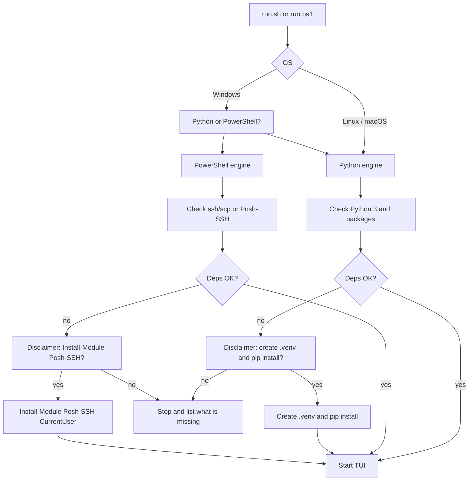
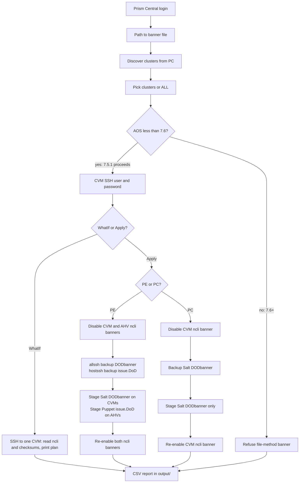

# Nutanix SSH consent banner

Applies a **custom SSH pre-auth banner** on Controller VMs and AHV hosts
(and CVM-side only on Prism Central VMs) across clusters discovered from
Prism Central.

The banner **text is not in this repo**. You point the TUI at a file you
already have.

## Start (all OSes)

| OS | Command |
|---|---|
| Linux / macOS | `./run.sh` |
| Windows | `.\run.ps1` |

There is no unattended / flag / CSV mode. The launcher starts a TUI.

**Windows:** first question is Python or PowerShell.

**Linux / macOS:** Python only. PowerShell is not offered.

### Dependencies

The launcher **checks first**. If packages are already there, it starts the
TUI with no prompt.

If something is missing it shows a **disclaimer** and asks Y/N:

- **Python Yes:** creates a local `.venv` and `pip install -r requirements.txt`.
  Does not install the Python interpreter or change system Python.
- **PowerShell Yes (Windows, only if `ssh`/`scp` are missing):**
  `Install-Module Posh-SSH -Scope CurrentUser`.
  If OpenSSH is already present, PowerShell starts with no install.

Answer **N** and the launcher stops and lists what is missing.

You must already have **Python 3** (for the Python engine) or **PowerShell**
(Windows engine). The launcher will not install those.

## Flow

### Start



### TUI and apply



The diamond is “AOS less than 7.6?” — **7.5.1 proceeds**, **7.6+ is refused**.

## What it does

Glean procedure for **AOS 7.5.1 / AHV 11.0.1**. The banner is the SSH
**consent text before authentication**, not MOTD.

The workstation SSHs to **one CVM**. That CVM fans out.

**PE** (AOS before 7.6):

1. `ncli cluster edit-cvm-security-params enable-banner=false`
2. `ncli cluster edit-hypervisor-security-params enable-banner=false`
3. `allssh` backup `/srv/salt/security/CVM/sshd/DODbanner` → `DODbannerbak`
4. `hostssh` backup `/etc/puppet/modules/kvm/files/issue.DoD` → `issue.DoD.bak`
5. Stage your file onto the CVM Salt path (`svmips`)
6. Stage the same file onto the AHV Puppet path (`hostips`)
7. Re-enable both ncli banners

**Prism Central** (no AHV): CVM ncli disable → backup Salt `DODbanner` →
stage that file → CVM ncli enable.

**AOS 7.6 and newer** is refused (file edits are deprecated).

## TUI screens

1. Prism Central login (basic or API key)
2. Path to your banner file
3. Discovered clusters — numbers or `ALL` (7.6+ marked REFUSE)
4. CVM SSH user/password per cluster (or reuse / apply to remaining)
5. WhatIf vs Apply
6. Live output + `output/banner-report_*.csv` (status only, no passwords)

WhatIf reads ncli/checksums and prints the plan. It does not edit the cluster.

After a real apply, open a **new** SSH to a CVM and an AHV. The custom banner
should appear before the password prompt.

## Layout

```
run.sh / run.ps1          Launchers
banner.py                 Python TUI entry
banner.ps1                PowerShell TUI entry
ntx/                      Python engine
NtnxBanner/               PowerShell engine
remote/apply-umicore-banner.sh   Runs on the CVM
requirements.txt
```
